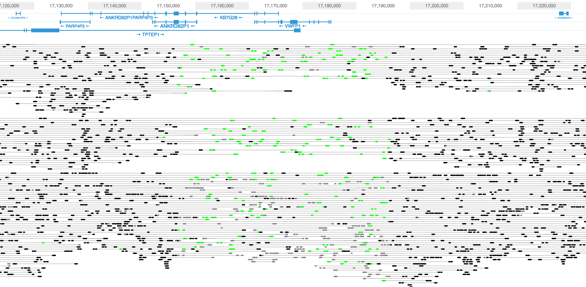
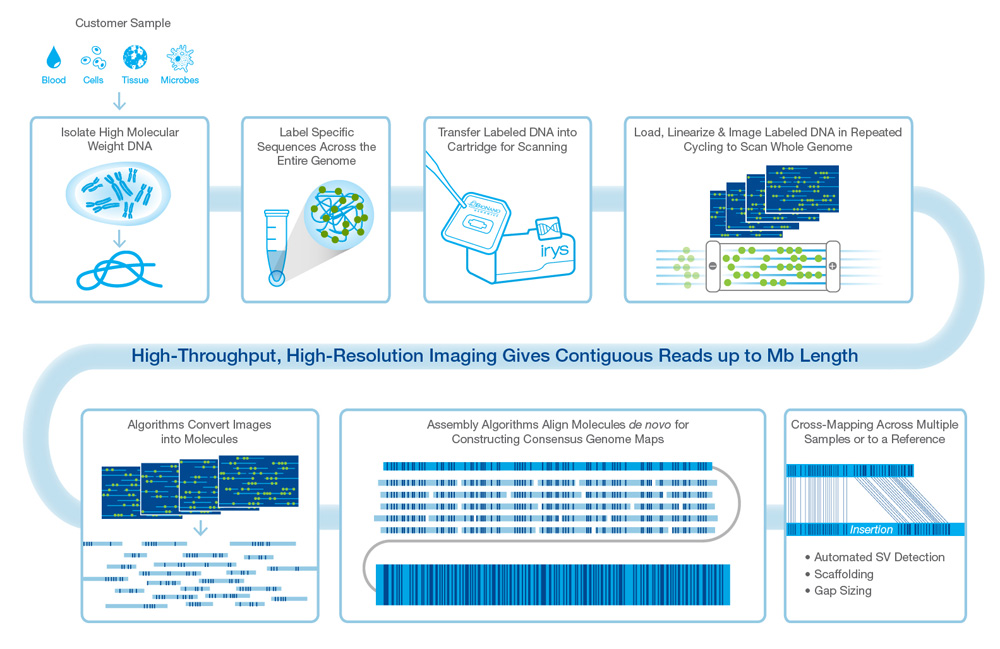

## Assembling Genomes Using Large Molecule Sequencing

Shaun Jackman [\@sjackman][]

2016-06-30

[][cc-by]

[Fork me on GitHub!][]

[\@sjackman]: http://twitter.com/sjackman
[cc-by]: http://creativecommons.org/licenses/by/4.0/
[Fork me on GitHub!]: https://github.com/sjackman/giab-slides

## Shaun Jackman

| [BC Cancer Agency Genome Sciences Centre][]
| Vancouver, Canada
| [\@sjackman][] | [github.com/sjackman][] | [sjackman.ca][]

[BC Cancer Agency Genome Sciences Centre]: http://bcgsc.ca
[github.com/sjackman]: https://github.com/sjackman
[sjackman.ca]: http://sjackman.ca

Sequencing Technologies
================================================================================

## Paired-end Sequencing

+ 40 kbp Fosmid
+ 200 kbp BAC
+ 800 bp Illumina paired-end
+ 6 kbp Illumina mate-pair

## Large Molecule Sequencing

+ PacBio
    + up to 100 kbp reads
+ Oxford Nanopore
    + up to 500 kbp reads

## New Technologies

+ 10x Genomics Chromium Linked Reads
    + up to 200 kbp molecules
+ BioNano Genomics Irys
    + up to 1000 kbp molecules

Assemble Long Reads
================================================================================

## Long Read Assemblers

+ [Canu][]: PacBio or Nanopore
+ [Falcon][]: PacBio
+ [Miniasm][]: PacBio or Nanopore
+ [SPAdes][]: PacBio or Nanopore with Illumina

[Canu]: http://canu.readthedocs.io/en/latest/
[Falcon]: https://github.com/PacificBiosciences/FALCON
[Miniasm]: https://github.com/lh3/miniasm
[SPAdes]: http://bioinf.spbau.ru/spades

## Polish

+ [Nanopolish][] for Nanopore
+ [Pbdagcon][] for PacBio
+ [Pilon][] for Illumina

[Nanopolish]: https://github.com/jts/nanopolish
[Pbdagcon]: https://github.com/PacificBiosciences/pbdagcon
[Pilon]: http://www.broadinstitute.org/software/pilon/]

10x Genomics Chromium
================================================================================

----------------------------------------

## Assemble Chromium

+ [Supernova][]
+ [ABySS][] for contigs, scaffolding is under way

## Scaffold with Chromium

+ [Fragscaff][] <small>(intended for an older technology)</small>
+ [Architect][]
+ BCGSC [ARCS][] with [LINKS][]

[ABySS]: https://github.com/bcgsc/abyss
[Architect]: https://github.com/kuleshov/architect
[ARCS]: https://github.com/bcgsc/arcs
[Fragscaff]: http://krishna.gs.washington.edu/software.html
[LINKS]: https://github.com/warrenlr/LINKS
[Supernova]: http://support.10xgenomics.com/de-novo-assembly/software/overview/welcome

BioNano Genomics Irys
================================================================================

----------------------------------------

## Scaffold with BioNano

+ [HybridScaffold][]

[HybridScaffold]: http://bionanogenomics.com/wp-content/uploads/2016/04/30073-Rev-A-Hybrid-Scaffolding-Theory-of-Operations.pdf

Sitka Spruce *Picea sitchensis*
================================================================================

## Sitka Spruce Mitochondrion 

### Aim

Assemble the Sitka spruce mitochondrion into a single scaffold\* using 10x Chromium data.

\* if it has a single chromosome

## Method

+ Align Sitka spruce reads to white spruce organelles
+ Filter out mismapped nuclear reads (AS < 40)
+ Identify 10x barcodes that contain at least one mitochondrial molecule
    + Four properly-paired mitochondrial reads
+ Select all the reads of these mitochondrial barcodes
+ Assemble with [ABySS][]
+ Scaffold with [ARCS][] and [LINKS][]
+ Fill gaps with [Sealer][]
+ Annotate genes with [MAKER][]
+ Submit to NCBI GenBank

[MAKER]: http://www.yandell-lab.org/software/maker.html
[Sealer]: https://github.com/bcgsc/abyss/tree/master/Sealer

fin
================================================================================

## Links

[ABySS][] | [ARCS][] | [Architect][] | [Canu][] | [Falcon][] | [Fragscaff][] | [HybridScaffold][] | [LINKS][] | [MAKER][] | [Miniasm][] | [Nanopolish][] | [Pbdagcon][] | [Pilon][] | [Sealer][] | [SPAdes][] | [Supernova][]

## Shaun Jackman

| [BC Cancer Agency Genome Sciences Centre][]
| Vancouver, Canada
| [\@sjackman][] | [github.com/sjackman][] | [sjackman.ca][]

